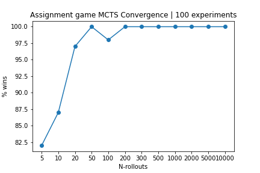
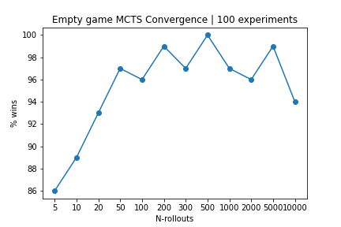
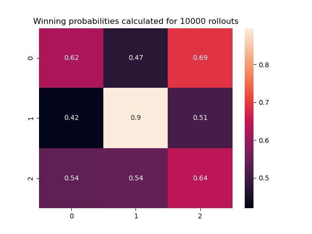
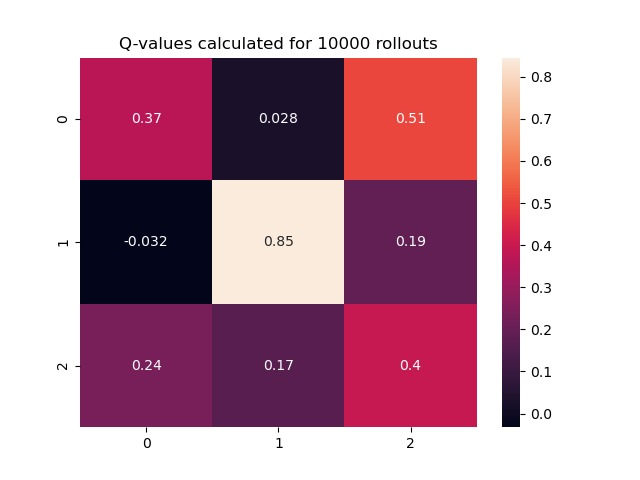
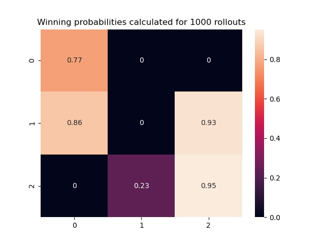
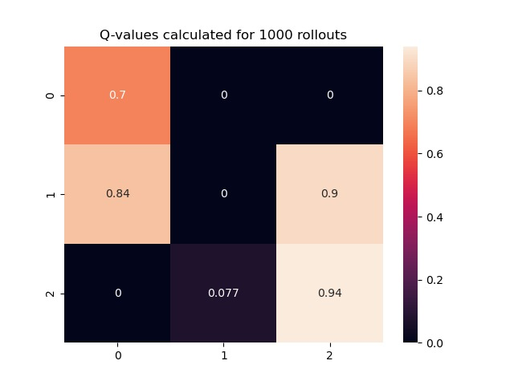

# MCTS - tic-tac-toe
tic-tac-toe Monte Carlo Tree Search

## Instsallation
How to install package depenencies.
### Prerequisties
* Python >= 3.7

### Install Python packages
``` bash
pip install -r requirements.txt
```

## Available initial states
* empty game
* initial state (`--ini-game assignment`):

 
## Usage
* `--n-rollouts` is number of rollouts per Monte Carlo Tree Search interation (*aka* computational budget)
* `--ini-game` *empty* or *assignment*
* `--verbose` optional flag to increase number of logs

``` bash
python  main.py --n-rollouts N_ROLLOUTS --ini-game {empty,assignment} [--verbose]
```

For example:
bash
```
python main.py --n-rollouts 10 --ini-game assignment
```

Possible output
```
x plays with MCTS
Initial game:
_ o x
_ x _
o _ _
Player 'x' moved to (1,2)
_ o x
_ x x
o _ _
Player 'o' moved to (2,1)
_ o x
_ x x
o o _
Player 'x' moved to (1,0)
_ o x
x x x
o o _
Winner: x
```

## Bulk testing
To run the script **N** times you can use the `test.py` and `plot.py` scripts. 
* `test.py` runs main.py with dirrerent parameters and pickles results
* `plot.py` loads test results and create plots

### Usage
```bash
python test.py
python plot.py
```

## Convergence 




## Probabilities and Q-values in initial states
### Empty game



### Assignemnt game


